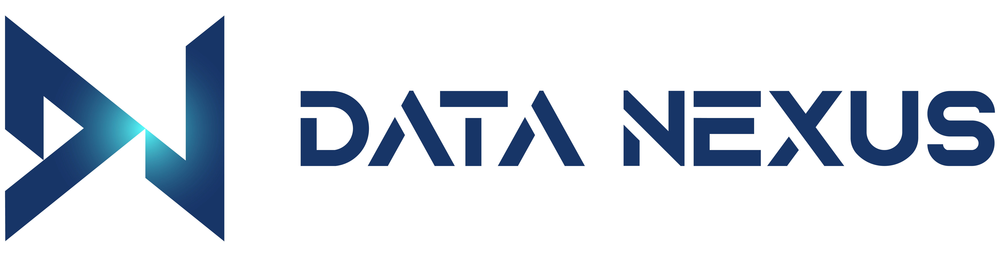
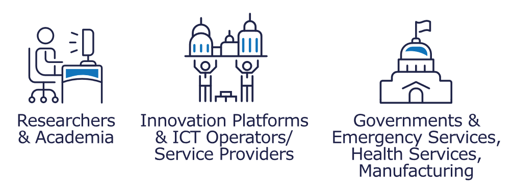
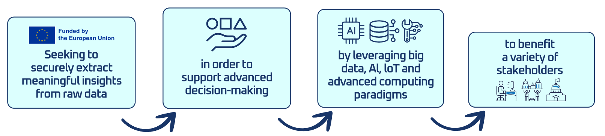

<h3>Innovative Approaches to Extreme Data Challenges: DataNexus Cluster</h3>

<iframe width="560" height="315" src="https://www.youtube.com/embed/n3xACMCbUw4?si=qYBNbCRlBDHnfKeY" title="YouTube video player" frameborder="0" allow="accelerometer; autoplay; clipboard-write; encrypted-media; gyroscope; picture-in-picture; web-share" referrerpolicy="strict-origin-when-cross-origin" allowfullscreen></iframe>

<h6>Seven EU-funded projects make up the DataNexus Cluster: Graph-Massivizer, EXTRACT, NEARDATA, EXA4MIND, EMERALDS, SYCLOPS, and EFRA. They seek to answer the Horizon Europe call for ‘Extreme data mining, aggregation and analytics technologies and solutions’</h6>

DataNexus projects develop solutions for managing extreme data-characterised volume, speed, and complexity – to securely extract mea ningful insights from raw data. These insights help support advanced decision-making, leveraging big data, artificial intelligence (AI), Inter net of Things (IoTs) and advanced computing paradigms. 

<section class="page-section" id="calltoaction">
    

        

            

                <h2 class="section-heading">DataNexus key goals</h2>
                

            

                <h6>Tackling Extreme Data Challenges</h6>
                
Data generation is increasing rapidly, but current technologies struggle to handle extreme amounts of data. Effectively analysing and vi sualising large and diverse data sets remains a challenge. DataNexus aims to solve this by developing advanced computing and data tech nologies that offer reliable solutions to users. 

                <h6>Integrating Cutting-edge Technologies</h6>
                
The seven DataNexus projects integrate innovative data mining, analytics and visualisation technologies to create robust frameworks for better data management and interpretation. AI, IoT and advanced computing paradigms such as HPC and edge/fog/cloud computing converge to enable real-time processing and analysis across the entire computing continuum. 

                <h6>Achievements and Innovations</h6>
                
The projects significantly improve data processing, analysis and visualisation, increasing accuracy, speed and usability for a variety of applications. These advances will benefit fields such as crisis management, healthcare, mobility, industry, environmental protection and food safety. The human-centred, user-friendly design ensures that the tools are practical and respond to key human needs.  

                

                
                

        

    

</section>

<section class="page-section" id="dn_partners">
  

    

      

        <h2 class="section-heading">{{ site.data.sitetext.dn_partners.title }}</h2>
      

    

    

    <h3 class="section-subheading text-center mt-5">{{ site.data.sitetext.dn_partners.text }}</h3>
    <section class="py-1" id="{{ site.data.sitetext.clients.section | default: " clients" }}">
      

        

          
          

            
          

          
        

      

    </section>
  

</section>

<section class="page-section" id="other">
    

        

            

                <h2 class="section-heading">Other information</h2>
            

        

        

        

            
            

                

                    

                      <h5 class="card-title">{{ information.title }}</h5>
                      <h6 class="card-subtitle mb-2 text-muted">{{ information.subtitle }}</h6>
                      <a href="{{ information.file }}" class="card-link"><i class="fas fa-file-pdf"></i> Link</a>
                    

                  

            

               
        
   
    

</section>